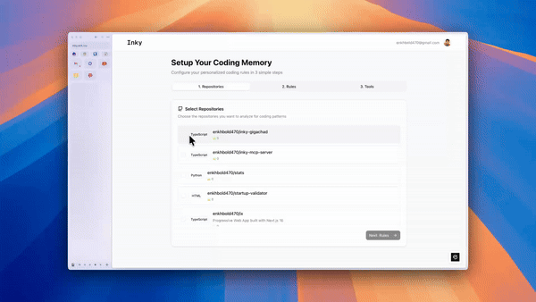
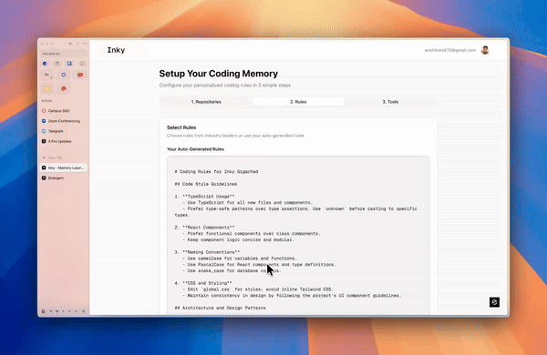

# Inky - Memory Layer for Personalized Coding

**Inky** helps developers maintain consistent coding styles across IDEs by analyzing GitHub repositories and generating personalized coding rules that integrate with AI coding assistants via MCP.

## ✨ Features

### Repository Analysis


Connect GitHub, select repositories, and extract coding patterns automatically.

### Rule Generation


AI-powered rule generation with visual progress tracking and markdown context integration.

### Rule Management


Create, edit, and manage coding rules with version control and semantic search.

### MCP Integration


Seamless integration with Windsurf, Cursor, Claude Code, and CodeX via Model Context Protocol.

## 🛠️ Tech Stack

**Frontend**: Next.js 16, TypeScript, React 19, Tailwind CSS 4, Shadcn UI  
**Backend**: Next.js Server Actions, Clerk Auth, PostgreSQL (Neon), Prisma  
**AI/ML**: OpenAI (GPT-4, embeddings), Pinecone (vector search)  
**Infrastructure**: pnpm, Vercel

## 🚀 Quick Start

### Prerequisites
- Node.js 20+, pnpm
- PostgreSQL (Neon), Clerk, Pinecone, OpenAI API key

### Installation

```bash
git clone <repository-url>
cd inky-gigachad
pnpm install
```

### Environment Variables

Create `.env`:
```env
DATABASE_URL="postgresql://..."
NEXT_PUBLIC_CLERK_PUBLISHABLE_KEY="pk_..."
CLERK_SECRET_KEY="sk_..."
PINECONE_API_KEY="..."
PINECONE_INDEX="inky-rules"
OPENAI_API_KEY="sk-..."
NEXT_PUBLIC_APP_URL="http://localhost:3000"
```

### Setup

```bash
pnpm prisma generate
pnpm prisma db push
pnpm dev
```

Visit [http://localhost:3000](http://localhost:3000)

### Service Setup

- **Clerk**: Create app, configure GitHub OAuth
- **Pinecone**: Create index `inky-rules` (1536 dimensions, cosine metric)
- **OpenAI**: Get API key from platform.openai.com

## 🔌 MCP Integration

Configure MCP server for Windsurf, Cursor, Claude Code, or CodeX:

**HTTP Transport:**
```json
{
  "mcpServers": {
    "inky": {
      "url": "https://api.inky.dev/api/mcp",
      "headers": { "X-User-Id": "user_xxxxx" }
    }
  }
}
```

**Stdio Transport:**
```json
{
  "mcpServers": {
    "inky": {
      "command": "npx",
      "args": ["-y", "inky-mcp-server"],
      "env": {
        "USER_ID": "user_xxxxx",
        "INKY_API_URL": "https://api.inky.dev"
      }
    }
  }
}
```

## 📚 Documentation

- [Rule Generation](./docs/multistep-rule-generation.md)
- [Pinecone Setup](./docs/pinecone.md)
- [LLM Integration](./docs/llms-full-nextjs.md)

## 🚢 Deployment

Deploy to Vercel:
1. Push to GitHub
2. Import in Vercel
3. Add environment variables
4. Deploy

## 🤝 Contributing

Follow TypeScript best practices, use functional React components, and maintain code style consistency.

---

**Inky** - Your coding memory, everywhere you code. 🚀
